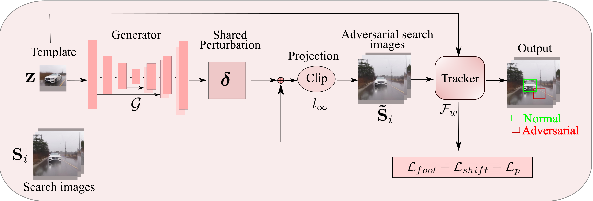

## Introduction

This is an official release of the paper **Universal, Transferable Adversarial Perturbations for Visual Object Trackers**.


**Abstract.** In recent years, Siamese networks have led to great progress in visual object tracking. While these methods were shown to be vulnerable to adversarial attacks, the existing attack strategies do not truly pose great practical threats. They either are too expensive to be performed online, require computing image-dependent perturbations, lead to unrealistic trajectories, or suffer from weak transferability to other black-box trackers. In this paper, we address the above limitations by showing the existence of a universal perturbation that is image agnostic and fools black-box trackers at virtually no cost of perturbation. Furthermore, we show that our framework can be extended to the challenging targeted attack setting that forces the tracker to follow any given trajectory by using diverse directional universal perturbations. At the core of our framework, we propose to learn to generate a single perturbation from the object template only, that can be added to every search image and still successfully fool the tracker for the entire video. As a consequence, the resulting generator outputs perturbations that are quasi-independent of the template, thereby making them universal perturbations. Our extensive experiments on four benchmarks datasets, i.e., OTB100, VOT2019, UAV123, and LaSOT, demonstrate that our universal transferable per- turbations (computed on SiamRPN++) are highly effective when transferred to other state-of-the-art trackers, such as SiamBAN, SiamCAR, DiMP, and Ocean online.


## Installation

1. It is tested with the following packages and hardware:

    ``` text
      PyTorch: 1.5.0
      Python: 3.6.9
      Torchvision: 0.6.0
      CUDA: 10.1
      CUDNN: 7603
      NumPy: 1.18.1
      PIL: 7.0.0
      GPU: Tesla V100-SXM2-32GB
   ```

2. Download source code from GitHub
   ```
    git clone https://github.com/krishnakanthnakka/Transferable_Perturbations.git
   ```
   
3. We release  ```pretrained generator checkpoints``` on SiamRPN++ (R) on [GoogleDrive](https://drive.google.com/drive/folders/1CawsQuwFiGlHxqLYM2BOOF9NxxI-U_m4?usp=sharing). Please place them in the root folder.


## Testing on SiamRPN++ (M)

1. Set all environmental paths and other packages in path by ```source envs.sh```

2. For attacking SiamRPN++ (M) tracker using the generator trained on ```SiamRPN++ (R)``` as discriminator and ```GOT10K``` dataset:
   
   ```py
    python tta_attack.py   --tracker_name=siamrpn_mobilev2_l234_dwxcorr --dataset=OTB100 --case=1 --gpu=1 --model_iter=4_net_G.pth --attack_universal
   ```
   

### Results on SiamRPN++ (M) tracker

1. We observe the following results as in Table 1.
    | Method | Success  | Precision | logfile |
    | :---:  | :---:     | :---:    |   :---: |
    |  Normal | 0.657     | 0.862    |   |
    |  Ours | 0.212     | 0.275    |   |

